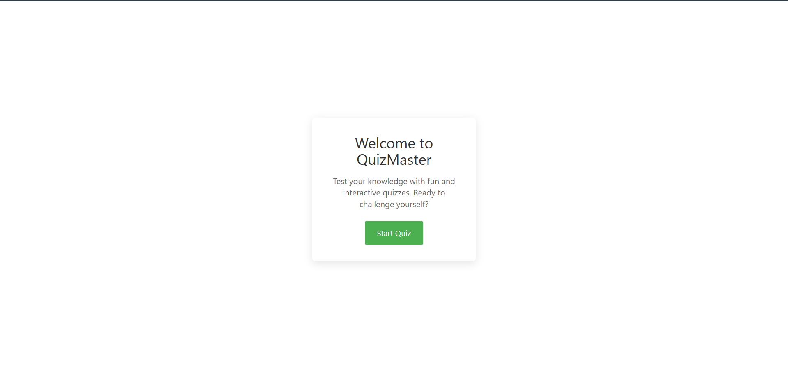
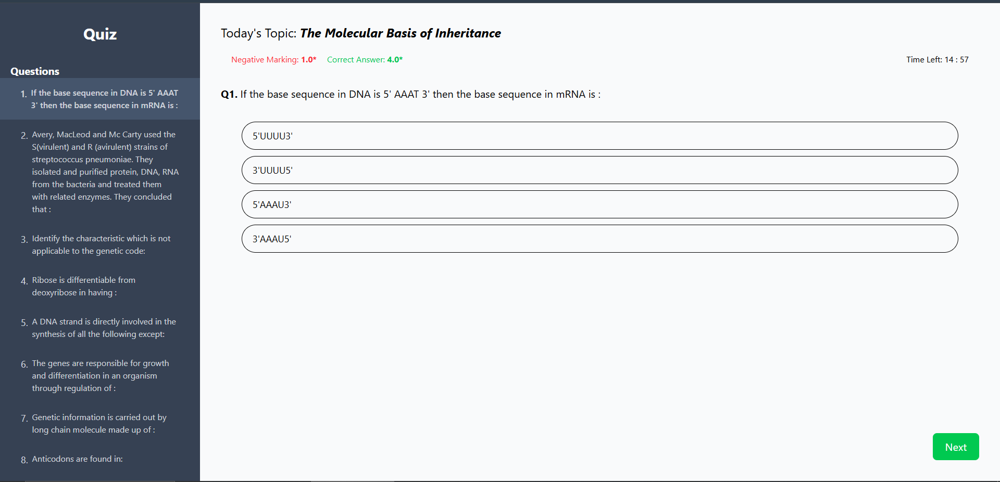
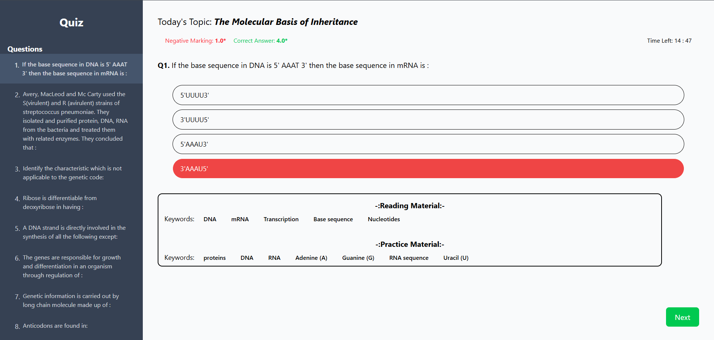
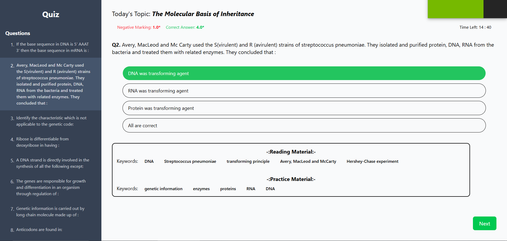
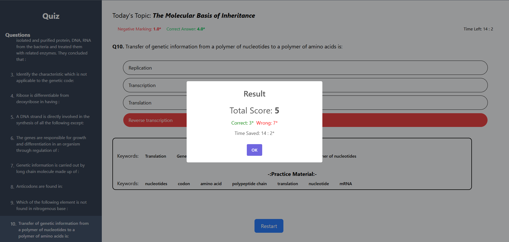

# Quiz App 

## 📌 Project Overview
This project is a web-based quiz application designed to provide an engaging quiz experience with gamification features. The application fetches quiz data from a provided API endpoint and presents multiple-choice questions to the user. A summary of the results, including total points scored, is displayed upon quiz completion.

## 📋 Features
- **Start Quiz**: Users can start the quiz at their convenience.
- **Multiple-Choice Questions**: Users can select answers from multiple options.
- **Result Summary**: A final screen displays total points scored.
- **Gamification Elements** (Optional): Enhanced user engagement through features like score tracking, achievements, or a timer-based challenge.

## 🛠 Technology Stack
- **Framework**: React-vite
- **Styling**: [Tailwind CSS, Styled Components, etc.]

## 🚀 Live Demo
- [Provide a deployed link if hosted on Vercel, Netlify, etc.]

## 📸 Screenshots & Video Walkthrough
<p align="center">
   
   
   
   
   
</p>
<video align="center" width="520" height="540" controls>
  <source src="./public/img/demo.mp4" type="video/mp4">
</video>

## 🏗 Installation & Setup
1. Clone the repository:
   ```sh
   git clone https://github.com/Kalyan0101/QuizApp
   cd QUIZAPP
   # or
   # download the zip file
   ```
2. Install dependencies:
   ```sh
   npm install  # or yarn install
   ```
3. Start the development server:
   ```sh
   npm run dev  # or yarn run dev
   ```
4. Open the application in your browser at `http://localhost:5173`.

## 📖 Usage Guide
- Click "Start Quiz" to begin.
- Select answers for each question.
- View the result summary at the end.
- Try again to improve your score!

## 🌐 API Integration
- API Endpoint: `-----------`
- Data is fetched and handled securely.

## 👤 Author & Contact
- **Developed by**: [Kalyan]
- **Contact**: [GitHub Profile](https://github.com/Kalyan0101)

---
Thank you for reviewing my submission! Looking forward to your feedback. 🚀

